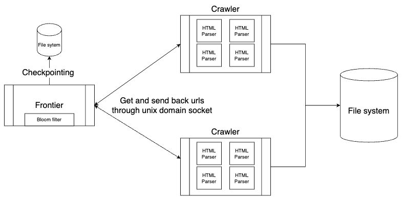

# Crawly

A web crawler worker designed to work with Frontier to parse HTML files.

TODO: Add to README


## Usage
```
mkdir build && cd build
cmake -DCMAKE_BUILD_TYPE=Debug ..
make
export FRONTIER_IP=...
export FRONTIER_PORT=...
./crawly -a $FRONTIER_IP -p $FRONTIER_PORT -o /Users/wonbinjin/index/test
```

## Architecture

